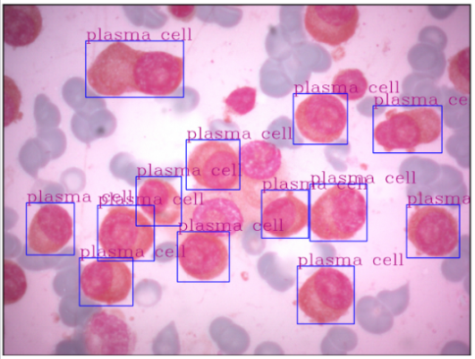

# Multiple Myeloma Dataset

First and foremost, thanks for your interest in using our dataset with labeled cells design to support the detection of Plasma Cells.

This repository contains images of different cells, including Plasma ones, collected from histological slides of bone marrow aspirate stained with Wright-Giem. Moreover, we also shared a Deep Neural Network trained to help diagnose Multiple Myeloma (MM), a plasma cell oncohematology with the highest incidence, which is more frequent in individuals over 50 years old. According to the International Agency for Research on Cancer of the World Health Organization (WHO), in 2020, MM was responsible for 176,404 new cases and 117,077 deaths of patients of both sexes.

The dataset was created by the following the steps: (a) bone marrow aspirate procedure; (b) Wright-Giemsa stained bone marrow aspirate smear slides from MM patients, analyzed by the oncohematology and immunophenotyping service of the Laboratory of Immunology and Molecular Biology; (c) Observation of stained slides in visible light optical microscopes and image capture by smartphone device; (d) Identification and labeling of detected cells.

The following image shows an example of our dataset. This image contains a set of bounding boxes drawn by specialists used as ground truth in our experiments.

Here you will find all codes, models, and data used in the manuscript “Enhancing Diagnostic Accuracy of Multiple Myeloma through ML-Driven Analysis of Hematological Slides: New dataset and identification model to support hematologists” (Journal, 2024).

The organization of this repository is:

> - **/data** - contains images wit labeled cells
> - **/src** - contains source codes created to train and assess the DNN model used to identify Plasma cells
> - **/docker** - contains docker images used to reproduce our experiments
> - **/noteboks** - contains Python notebooks used to visualize imagens and reproduce our findings
> - **/models** - contains frozen models used to detect plasma cells in our images
If you find any issues with the code, please contact us: ricardoar@ufba.br.

On the behalf of all of the authors, we appreciate your interest in our data, code and models, and hope they are useful to your research.

